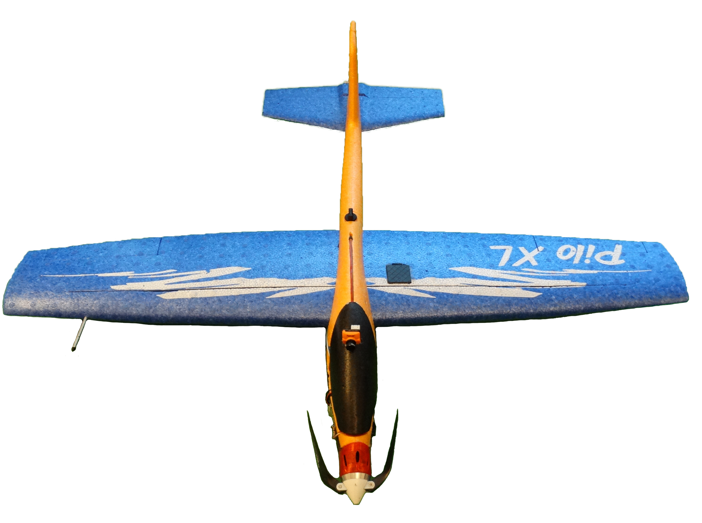
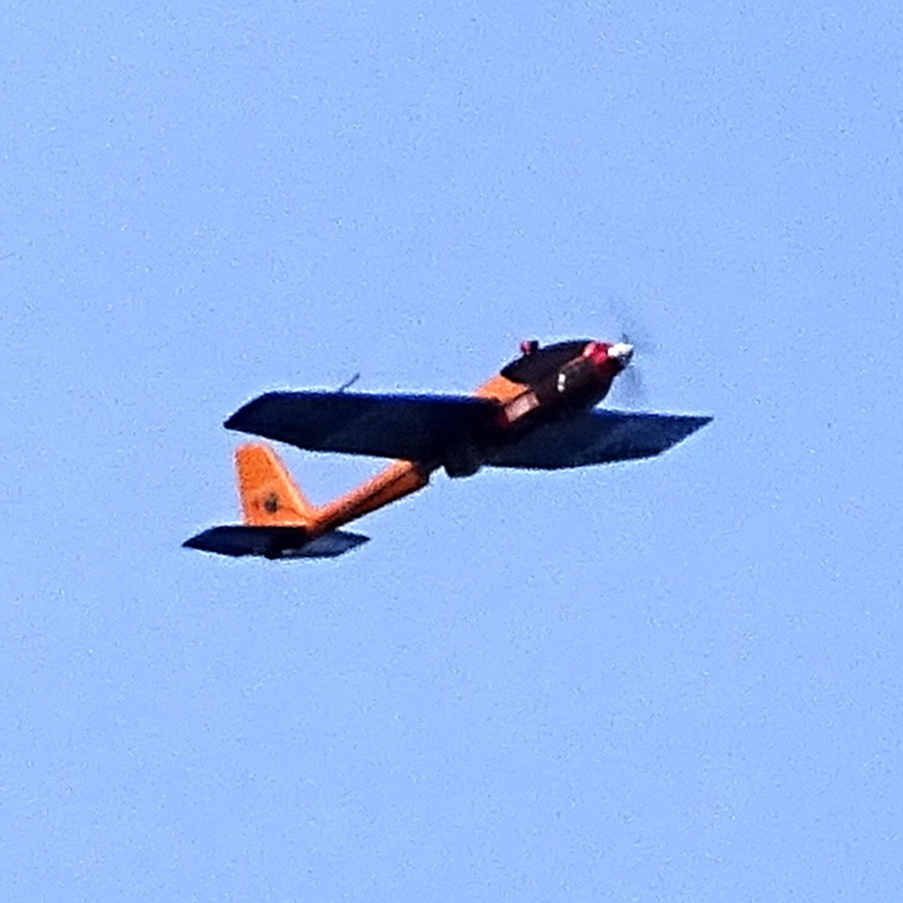

 
  
  
  
  

# OpenPlaneProject
This project is all about designing and building affordable autonomous planes. It aims to provide plans, files and detailed info about the build for free. While the open source software solutions for controlling UAVs are out there and easy to use, this project focuses on the mechanical part to get everyone a reliable platform for many use cases. You can find more information on Hackaday.io: https://hackaday.io/project/183150-open-plane-project

